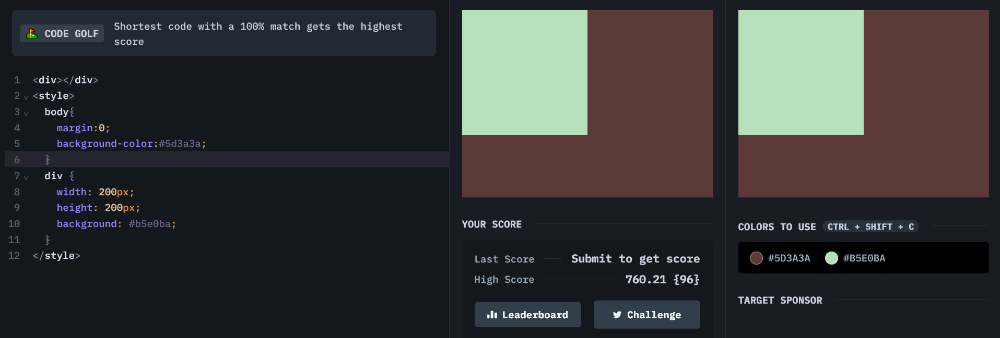

# Battle #1 - Pilot Battle

## #1 - Simple Square

[Link to the problem](https://cssbattle.dev/play/1)



```html
<div></div>
<style>
  body{
    margin:0; /* to remove default margin by body */
    background-color:#5d3a3a;
  }
  div {
    width: 200px;
    height: 200px;
    background: #b5e0ba;
  }
</style>
```
## Learning
- The asterisk (*), also known as the CSS universal selector, is used to select all items in an HTML file.