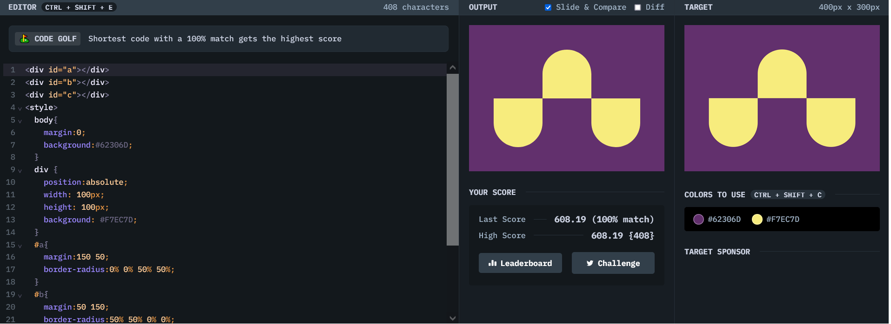

# Battle #1 - Pilot Battle

## #4 - Up and downs

[Link to the problem](https://cssbattle.dev/play/4)



```html
<div id="a"></div>
<div id="b"></div>
<div id="c"></div>
<style>
  body{
    margin:0;
    background:#62306D;
  }
  div {
    position:absolute;
    width: 100px;
    height: 100px;
    background: #F7EC7D;
  }
  #a{
    margin:150 50;
    border-radius:0% 0% 50% 50%;
  }
  #b{
    margin:50 150;
    border-radius:50% 50% 0% 0%;
  }
  #c{
    margin:150 250;
    border-radius:0% 0% 50% 50%;
  }
</style>

```
## Learning
- Syntax to crate border radius: ```border-radius: top-left top-right bottom-left bottom-right```
- Z-index for to stacking elements one on an above using z-index values