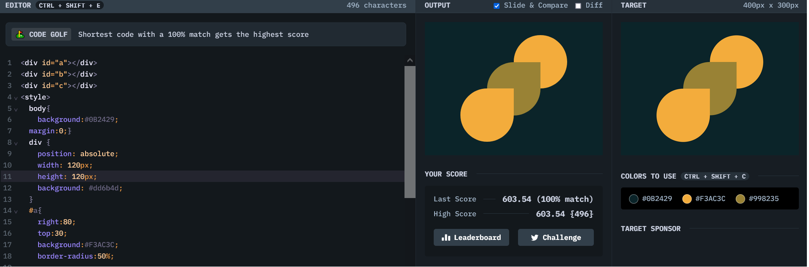

# Battle #1 - Pilot Battle

## #5 - Acid rain

[Link to the problem](https://cssbattle.dev/play/5)



```html
<<div id="a"></div>
<div id="b"></div>
<div id="c"></div>
<style>
  body{
    background:#0B2429;
  margin:0;}
  div {
    position: absolute;
    width: 120px;
    height: 120px;
    background: #dd6b4d;
  }
  #a{
    right:80;
    top:30;
    background:#F3AC3C;
    border-radius:50%;
    
  }
  #b{
    right:140;
    bottom:90;
    background:#998235;
    border-radius:50% 0 50% 50%;
  }
  #c{
    right:200;
    top:150;
    background:#F3AC3C;
    border-radius:50% 0 50% 50%;
  }
</style>
```
