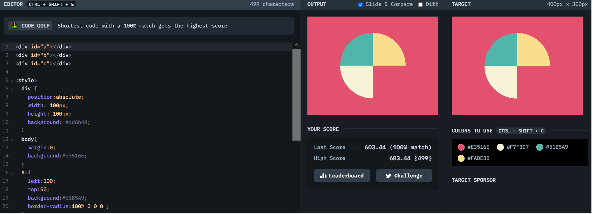

# Battle #1 - Pilot Battle

## #6 - Missing Slice

[Link to the problem](https://cssbattle.dev/play/6)



```html
<div id="a"></div>
<div id="b"></div>
<div id="c"></div>

<style>
  div {
    position:absolute;
    width: 100px;
    height: 100px;
    background: #dd6b4d;
  }
  body{
    margin:0;
    background:#E3516E;
  }
  #a{
    left:100;
    top:50;
    background:#51B5A9;
    border-radius:100% 0 0 0 ;
  }
  #b{
    left:200;
    top:50;
    background:#FADE8B;
    border-radius:0 100%  0 0 ;
  }
  #c{
    left:100;
    top:150;
    background:#F7F3D7;
    border-radius:0 0 0 100%   ;
  }
</style>
```
