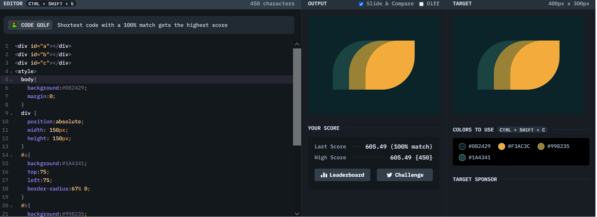

# Battle #1 - Pilot Battle

## #7 - leafy trail

[Link to the problem](https://cssbattle.dev/play/7)



```html
<div id="a"></div>
<div id="b"></div>
<div id="c"></div>
<style>
  body{
    background:#0B2429;
    margin:0;
  }
  div {
    position:absolute;
    width: 150px;
    height: 150px;
  }
  #a{
    background:#1A4341;
    top:75;
    left:75;
    border-radius:67% 0;
  }
  #b{
    background:#998235;
    top:75;
    left:125;
    border-radius:67% 0;
  }
  #c{
    background:#F3AC3C;
    top:75;
    left:175;
    border-radius:67% 0;
  }
</style>
```
